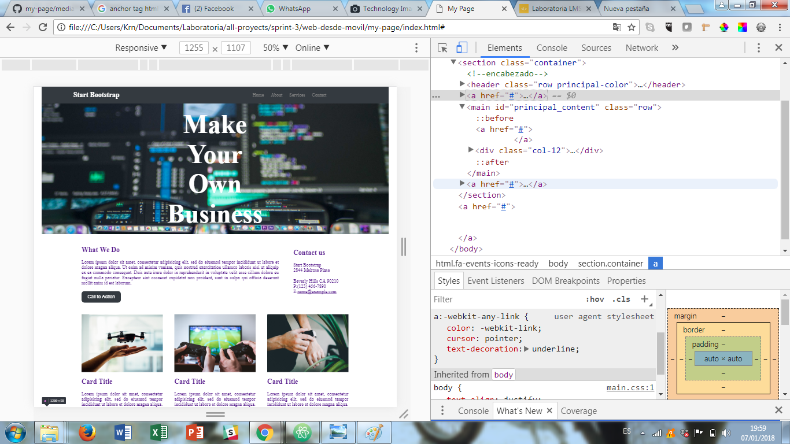

#### El Reto: ####

Crear un página Web responsive para visualizarse en dispositivos moviles, utilizando un grid de nuestra elección.

#### La Solución ####

En eta ocación utilice el grip basado en filas y columnas en la cual maqueté la estructura de la página, lo cual resulto más fácil ya que el contenido se acomodaba facilmente.

En cuanto al uso de media queries, ajuste al max-width 768px; para que se ajustaran los cambios al verlo en un dispositivo movil. Por el tipo de maquetación el ajuste de las columnas tendria que pasar a 100%.

#### Los Obstaculos ####

 * Al usar background-image en la portada de la página, la imagen excede el tamaño del contenedor utilizando background-size: cover, sin embargo con background-size: contain, la imagen no barca el espacio deseado, probablemente por el pixelage.

 * Menu para dispositivos moviles. Solo se maqueto el icono ya que se requiere el uso de js para hacerlo funcional (segunda etapa)

 * El texto la etiqueta main y footer parace estar dentro de una etiqueta anchor, aunque en codigo no se visualiza la etiqueta en consola si. No sé como describirlo para investigar una solución.
  * Falsa Alarma, mis compañeras me ayudaron a ver que no habia una etiqueta <a> cerrada :)

 Asi se ve en consola:

 
